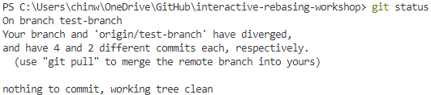
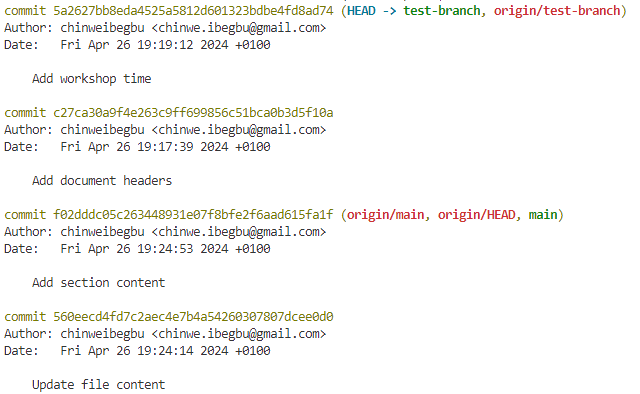
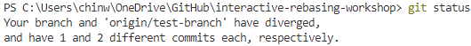

# Workshop Tutorial

### Repository Setup
1. Create a repository with a `README.md` file
   
2. Clone the repository to your local system
   ```shell
   > git clone <HTTPS-URL>
   ```
   
3. Commit a couple of changes to `main` and push to its remote counterpart, `origin/main`
   ```shell
   > git add . <br>
   > git commit -m "<commit-message>"
   > git push
   ```

4. Create a new branch locally off `main` called `test-branch`
   ```shell
   > git checkout -b test-branch
   ```

5. Make changes to the `README.md` file

6. Commit and push the changes made in this new branch
   ```shell
   > git add . <br>
   > git commit -m "<commit-message>" <br>
   > git push --set-upstream origin test-branch
   > git push
   ```

7. Make a different change and push another commit to `origin/test-branch`
   
8. Checkout to `main`, make two (2) different commits and push to `origin/main`
   ```shell
   > git checkout main
   > git add .
   > git commit -m "<commit-message>"
   > git push
   ```
   
9.  On GitHub, create a [Pull Request](https://github.com/chinweibegbu/interactive-rebasing-workshop/pull/1) from `origin/test-branch` to `origin/main`

<br>

**RESULT**: `origin/test-branch` is now two (2) commits ahead of `main` and two (2) commits behind `origin/main`.

### Basic Rebasing

**AIM**: Update `test-branch` to include the changes made in `main` after it branched off

1. Back in the terminal, checkout to `test-branch`
   ```shell
   > git checkout test-branch
   ```

2. Rebase `test-branch` to `main`
    ```shell
    > git rebase main
    ```

    ***NOTE**: Rebasing is carried out on a commit-by-commit basis. When you have handled the merge conflicts of the current commit, you must stage it (a.k.a. `add .` it). You can see how this can becoem tedious with a large number of commits.*

3. Continue rebasing by staging the changes made by merge conflict resolution and continuing the rebasing process manually
    ```shell
    # handle merge conflicts...
    > git add .
    > git rebase --continue
    # repeat...
    ```

4. When you have gone through all the commits, check the status of the repository
   ```shell
   > git status
   ```

   ***NOTE**: This will show that `test-branch` has 4 commits (2 from `main` + 2 originally from `test-branch`) while `origin/test-branch` still has only 2 commits (see the image below).*

   
   
5. Push the changes to `origin/test-branch`
   ```shell
   > git push --force
   ```
   
   ***NOTE**: The `--force` flag is necessary because Git does not usually allow you to change history, which is what rebasing does. An attempt to push the changes without the flag will be rejected.*

<br>

**RESULT**: `origin/test-branch` is now only two (2) commits ahead of `main`.

### Interactive Rebasing

**AIM**: Squash the two original `test-branch` commits into one commit

1. Confirm that you are in `test-branch`
   ```shell
   > git status
   ```
   
2. Identify the SHA of the last commit in common between the base branch and the rebased branch 
   ```shell
   > git log
   ```

   ***NOTE**: The idea here is that you want to get the commit AFTER which you want to squash. Usually, this is the commit with the `main` tag (see the image below); however, it is suggested to consciously identify the commit and copy its SHA.*

   
   
3. Start the interactive rebasing session 
   ```shell
   > git rebase -i <commit-SHA>
   ```

4. In the VIM editor that opens up, decide on the changes you want to make to each commit
   * Enter insert mode by pressing the `A` key
   * Change the operation at the beginning of each commit summary line to match the decisions you've made e.g. `squash`, `reword`
   * Exit insert mode by pressing the `ESC` key
   * Write and quit the editor using the `:wq!` command

    ***NOTE**: Read more about VIM commands [here](https://vim.rtorr.com/)..*

5. If you specify a `reword` operation for any of the commits, a new VIM editor in which to make your changes to the entire commit message will pop up - make the changes, write and quit
   
6. In the next VIM editor that opens up, finalise the commit message of the resulting squashed commit, keeping in mind that the first line is the title of the commit message
   
7. When you are done with the interactive rebasing, check the status again to show the new difference between `test-branch` and `origin/test-branch` (see the image below)

    

8. Push the new changes to `origin/test-branch`
   ```shell
   > git push --force
   ```

**RESULT**: `origin/test-branch` is now only one (1) commit ahead of `main`.